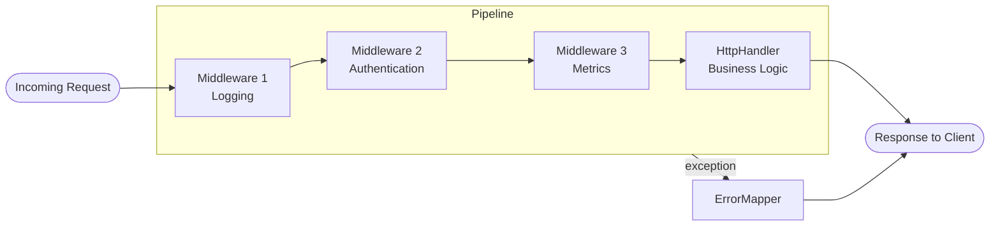
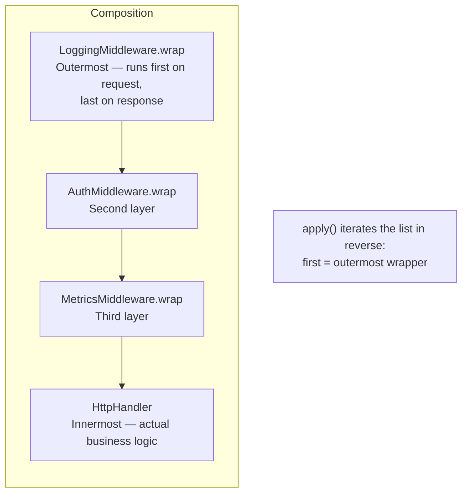

# ether-http-core

Transport-agnostic HTTP contracts and reusable primitives for routing, error mapping, auth policies, and query parsing in the Ether framework.

## Maven Dependency

```xml
<dependency>
    <groupId>dev.rafex.ether.http</groupId>
    <artifactId>ether-http-core</artifactId>
    <version>8.0.0-SNAPSHOT</version>
</dependency>
```

## Overview

`ether-http-core` defines the foundational contracts that every HTTP transport adapter in Ether must implement. It is intentionally free of any servlet, Jetty, or Netty dependencies. The module contains interfaces, records, and utilities that can be composed to build a complete HTTP handling pipeline without coupling business logic to a specific server runtime.

The central idea is a layered pipeline:

1. An incoming request is represented as an `HttpExchange`.
2. A chain of `Middleware` instances wraps the core `HttpHandler`, adding cross-cutting behaviour (logging, authentication, metrics, etc.) without modifying the handler itself.
3. The core `HttpHandler` processes the request and writes a response back through `HttpExchange`.
4. If an unhandled exception escapes, an `ErrorMapper` converts it into a structured `HttpError`.

---

## HTTP Pipeline



Each middleware calls `next.handle(exchange)` to delegate to the next layer. The innermost function is the actual `HttpHandler`. Exceptions bubble up through the chain and are caught by the transport adapter, which uses the configured `ErrorMapper` to produce a structured response.

---

## Middleware Composition (Decorator Pattern)



Middleware is composed by repeated wrapping. `apply(handler, List.of(logging, auth, metrics))` produces a chain where logging executes first on the inbound path and last on the outbound path, giving it full visibility into the request and the final response status.

---

## Core API Reference

### `HttpExchange`

The transport-agnostic view of an HTTP request/response pair. Transport adapters implement this interface by delegating to their native server objects.

| Method | Description |
|---|---|
| `method()` | HTTP verb (GET, POST, etc.) in upper case |
| `path()` | Request path, e.g. `/users/42` |
| `pathParam(name)` | Extract a named path variable set by the router |
| `pathParams()` | All path variables as an immutable `Map<String,String>` |
| `queryFirst(name)` | First query string value for a named parameter |
| `queryAll(name)` | All query string values for a named parameter |
| `queryParams()` | Full query string as `Map<String, List<String>>` |
| `allowedMethods()` | HTTP methods declared as allowed on the matched route |
| `json(status, body)` | Serialize `body` to JSON and write to the response |
| `text(status, body)` | Write a plain-text response |
| `noContent(status)` | Write a response with no body |
| `methodNotAllowed()` | Shortcut: write a 405 JSON error |
| `options()` | Shortcut: write a 204 no-content response (CORS preflight) |

### `HttpHandler`

A `@FunctionalInterface` that processes a request. Returns `true` when the request was handled (response written), `false` to signal that no match was found and the transport may try the next handler.

```java
@FunctionalInterface
public interface HttpHandler {
    boolean handle(HttpExchange exchange) throws Exception;
}
```

### `Middleware`

A `@FunctionalInterface` that wraps an `HttpHandler` to add cross-cutting behaviour. Multiple middlewares are composed into a chain by repeatedly calling `wrap`.

```java
@FunctionalInterface
public interface Middleware {
    HttpHandler wrap(HttpHandler next);
}
```

### `Route`

A record holding a URL pattern and the set of HTTP methods it accepts. Pattern segments enclosed in `{braces}` are treated as named path variables.

```java
public record Route(String pattern, Set<String> allowedMethods) { ... }
```

The static factory `Route.of(pattern, methods)` normalises methods to upper-case. The wildcard pattern `/**` matches any path. The `allows(method)` method performs a case-insensitive membership check.

### `RouteMatch`

Carries the matched `Route` together with the extracted path variable map produced during pattern matching.

```java
public record RouteMatch(Route route, Map<String, String> pathParams) { }
```

### `AuthPolicy`

A record that classifies a path as publicly accessible (`PUBLIC_PATH`) or requiring authentication (`PROTECTED_PREFIX`).

```java
public record AuthPolicy(Type type, String method, String pathSpec) {
    public enum Type { PUBLIC_PATH, PROTECTED_PREFIX }
    public static AuthPolicy publicPath(String method, String pathSpec) { ... }
    public static AuthPolicy protectedPrefix(String pathSpec) { ... }
}
```

### `ErrorMapper`

Maps any `Throwable` to a structured `HttpError` record. The transport adapter calls this on unhandled exceptions.

```java
@FunctionalInterface
public interface ErrorMapper {
    HttpError map(Throwable error);
}
```

### `HttpError`

A plain record carrying the HTTP status code, a machine-readable error code, and a human-readable message.

```java
public record HttpError(int status, String code, String message) { }
```

### `QuerySpec`

Carries a parsed RSQL filter tree, pagination parameters, and sort instructions built by `QuerySpecBuilder`.

```java
public record QuerySpec(RsqlNode filter, int limit, int offset, List<Sort> sorts) {
    public static final int DEFAULT_LIMIT = 20;
    public static final int DEFAULT_OFFSET = 0;
}
```

`Sort` is a record with a `field` and a `Direction` (`ASC` or `DESC`).

---

## Examples

### 1. Implement a simple `HttpHandler`

```java
import dev.rafex.ether.http.core.HttpExchange;
import dev.rafex.ether.http.core.HttpHandler;
import java.util.Map;

// Java 21 records make DTO declarations concise.
public record UserProfile(String id, String name, String email) {}

public final class UserProfileHandler implements HttpHandler {

    private final UserService userService;

    public UserProfileHandler(UserService userService) {
        this.userService = userService;
    }

    @Override
    public boolean handle(HttpExchange exchange) throws Exception {
        var userId = exchange.pathParam("id");

        var maybeUser = userService.findById(userId);
        if (maybeUser.isEmpty()) {
            exchange.json(404, Map.of("error", "user_not_found", "id", userId));
            return true;
        }

        var user = maybeUser.get();
        exchange.json(200, new UserProfile(user.id(), user.name(), user.email()));
        return true;
    }
}
```

Simple handlers can be expressed as lambdas:

```java
HttpHandler health = exchange -> {
    exchange.json(200, Map.of("status", "UP", "service", "my-api"));
    return true;
};
```

A handler that dispatches on the HTTP method using a Java 21 switch expression:

```java
HttpHandler usersRouter = exchange -> switch (exchange.method()) {
    case "GET"    -> new ListUsersHandler(userService).handle(exchange);
    case "POST"   -> new CreateUserHandler(userService).handle(exchange);
    default       -> { exchange.methodNotAllowed(); yield true; }
};
```

---

### 2. Build a logging middleware

```java
import dev.rafex.ether.http.core.HttpHandler;
import dev.rafex.ether.http.core.Middleware;
import java.lang.System.Logger;
import java.lang.System.Logger.Level;

public final class LoggingMiddleware implements Middleware {

    private static final Logger LOG = System.getLogger(LoggingMiddleware.class.getName());

    @Override
    public HttpHandler wrap(HttpHandler next) {
        return exchange -> {
            var start = System.currentTimeMillis();
            LOG.log(Level.INFO, "→ {0} {1}", exchange.method(), exchange.path());
            try {
                var handled = next.handle(exchange);
                var elapsed = System.currentTimeMillis() - start;
                LOG.log(Level.INFO, "← {0} {1} [{2}ms]",
                    exchange.method(), exchange.path(), elapsed);
                return handled;
            } catch (Exception ex) {
                var elapsed = System.currentTimeMillis() - start;
                LOG.log(Level.ERROR, "← ERROR {0} {1} [{2}ms]: {3}",
                    exchange.method(), exchange.path(), elapsed, ex.getMessage());
                throw ex;
            }
        };
    }
}
```

The middleware captures the start time before delegating to `next`, then logs both the outcome and the elapsed time on return. Exceptions are re-thrown after logging so the `ErrorMapper` upstream can still handle them.

---

### 3. Build an authentication-checking middleware

```java
import dev.rafex.ether.http.core.HttpHandler;
import dev.rafex.ether.http.core.Middleware;
import java.util.Map;
import java.util.Set;

public final class BearerAuthMiddleware implements Middleware {

    private static final Set<String> PUBLIC_PATHS = Set.of(
        "/health", "/openapi.json", "/auth/login"
    );

    private final TokenValidator validator;

    public BearerAuthMiddleware(TokenValidator validator) {
        this.validator = validator;
    }

    @Override
    public HttpHandler wrap(HttpHandler next) {
        return exchange -> {
            if (PUBLIC_PATHS.contains(exchange.path())) {
                return next.handle(exchange);
            }

            // Headers are accessed through the transport adapter in real usage.
            // Here we illustrate the pattern with a query param fallback.
            var authHeader = exchange.queryFirst("Authorization");
            if (authHeader == null || !authHeader.startsWith("Bearer ")) {
                exchange.json(401, Map.of(
                    "error",  "unauthorized",
                    "detail", "Missing or malformed Authorization header"
                ));
                return true;
            }

            var token = authHeader.substring(7).strip();
            var principal = validator.validate(token);
            if (principal == null) {
                exchange.json(401, Map.of(
                    "error",  "unauthorized",
                    "detail", "Token is invalid or has expired"
                ));
                return true;
            }

            // Pass the principal downstream via a request-scoped attribute
            // (transport-specific; shown here conceptually).
            return next.handle(exchange);
        };
    }
}
```

---

### 4. Chain multiple middlewares together

```java
import dev.rafex.ether.http.core.HttpHandler;
import dev.rafex.ether.http.core.Middleware;
import java.util.List;

public final class MiddlewareChain {

    private MiddlewareChain() {}

    /**
     * Wraps {@code handler} with each middleware in declaration order.
     * The first element in {@code middlewares} becomes the outermost wrapper
     * (executes first on the way in, last on the way out).
     */
    public static HttpHandler apply(HttpHandler handler, List<Middleware> middlewares) {
        var result = handler;
        for (int i = middlewares.size() - 1; i >= 0; i--) {
            result = middlewares.get(i).wrap(result);
        }
        return result;
    }
}

// --- Assembling the pipeline ---

var tokenValidator = new JwtTokenValidator(jwtSecret);

var pipeline = MiddlewareChain.apply(
    new UserProfileHandler(userService),   // innermost: business logic
    List.of(
        new LoggingMiddleware(),            // outermost: sees every request
        new BearerAuthMiddleware(tokenValidator),
        new MetricsMiddleware(meterRegistry)
    )
);

// The pipeline is just an HttpHandler; the transport calls it.
boolean handled = pipeline.handle(exchange);
```

The execution order for an inbound request is: `LoggingMiddleware → BearerAuthMiddleware → MetricsMiddleware → UserProfileHandler`. The response travels in reverse: `UserProfileHandler → MetricsMiddleware → BearerAuthMiddleware → LoggingMiddleware`.

---

### 5. Use `Route` and `RouteMatcher`

```java
import dev.rafex.ether.http.core.Route;
import dev.rafex.ether.http.core.RouteMatcher;
import java.util.List;
import java.util.Set;

// Declare routes for a Users resource.
// {id} is a path variable — RouteMatcher extracts it automatically.
var routes = List.of(
    Route.of("/users",      Set.of("GET", "POST")),
    Route.of("/users/{id}", Set.of("GET", "PUT", "PATCH", "DELETE"))
);

// Simulate: GET /users/42
var path   = "/users/42";
var method = "GET";

var result = RouteMatcher.match(path, routes);

result.ifPresentOrElse(
    match -> {
        if (!match.route().allows(method)) {
            System.out.println("405 Method Not Allowed");
            return;
        }
        var userId = match.pathParams().get("id"); // "42"
        System.out.printf("Handling %s /users/%s%n", method, userId);
    },
    () -> System.out.println("404 Not Found")
);

// Wildcard catch-all route — matches any path:
var catchAll = Route.of("/**", Set.of("GET", "POST", "PUT", "DELETE", "PATCH", "OPTIONS"));
System.out.println(RouteMatcher.match("/any/nested/path", List.of(catchAll)).isPresent()); // true

// Using Route.allows for method dispatch in a handler:
HttpHandler dispatchingHandler = exchange -> {
    var match = RouteMatcher.match(exchange.path(), routes);
    if (match.isEmpty()) {
        exchange.json(404, Map.of("error", "not_found"));
        return false;
    }
    var routeMatch = match.get();
    if (!routeMatch.route().allows(exchange.method())) {
        exchange.methodNotAllowed();
        return true;
    }
    // Inject path params and delegate to the appropriate sub-handler.
    return subHandlerFor(routeMatch).handle(exchange);
};
```

---

### 6. Use `QuerySpec` for filtering and pagination

`QuerySpecBuilder` parses raw query string parameters — including RSQL expressions — into a structured `QuerySpec`.

```java
import dev.rafex.ether.http.core.query.QuerySpec;
import dev.rafex.ether.http.core.query.QuerySpecBuilder;

// Request: GET /users?q=role==admin;active==true&sort=-createdAt,name&limit=25&offset=50

var builder = new QuerySpecBuilder();

var spec = builder.fromRawParams(
    "role==admin;active==true", // q        — RSQL: semicolon = AND
    null,                       // tags     — comma-separated tag filter
    null,                       // locationId
    null,                       // enabled
    "-createdAt,name",          // sort     — "-" prefix means descending
    "25",                       // limit
    "50"                        // offset
);

System.out.println(spec.limit());  // 25
System.out.println(spec.offset()); // 50

for (var sort : spec.sorts()) {
    // Sort[field=createdAt, direction=DESC]
    // Sort[field=name, direction=ASC]
    System.out.printf("Sort: %s %s%n", sort.field(), sort.direction());
}

// Wiring QuerySpec inside an HttpHandler:
HttpHandler listUsersHandler = exchange -> {
    var spec2 = new QuerySpecBuilder().fromRawParams(
        exchange.queryFirst("q"),
        exchange.queryFirst("tags"),
        exchange.queryFirst("locationId"),
        exchange.queryFirst("enabled"),
        exchange.queryFirst("sort"),
        exchange.queryFirst("limit"),
        exchange.queryFirst("offset")
    );

    // limit is clamped to [1, 200]; offset is clamped to [0, 100_000].
    var page = userRepository.findAll(spec2);

    exchange.json(200, Map.of(
        "items",  page.items(),
        "total",  page.total(),
        "limit",  spec2.limit(),
        "offset", spec2.offset()
    ));
    return true;
};
```

---

### 7. Using built-in resources

```java
import dev.rafex.ether.http.core.builtin.HealthResource;
import dev.rafex.ether.http.core.builtin.HelloResource;
import dev.rafex.ether.http.core.Route;
import java.util.Set;

// HealthResource responds to GET /health with {"status":"UP","service":"ether"}.
var healthHandler = new HealthResource();

// The built-in resources implement HttpResource which provides method-dispatch helpers.
// Register the associated route:
var healthRoute = Route.of(HealthResource.DEFAULT_PATH, healthHandler.supportedMethods());

// Wrap with a method-guard using a Java 21 switch expression:
HttpHandler guardedHealth = exchange -> switch (exchange.method().toUpperCase()) {
    case "GET"     -> healthHandler.get(exchange);
    case "OPTIONS" -> { exchange.options(); yield true; }
    default        -> { exchange.methodNotAllowed(); yield true; }
};
```

---

### 8. Configuring `AuthPolicy`

```java
import dev.rafex.ether.http.core.AuthPolicy;
import java.util.List;

// Declare the access policy for each route family.
var policies = List.of(
    AuthPolicy.publicPath("GET",  "/health"),
    AuthPolicy.publicPath("GET",  "/openapi.json"),
    AuthPolicy.publicPath("POST", "/auth/login"),
    AuthPolicy.publicPath("POST", "/auth/refresh"),
    // All paths under /api/v1 require a valid token.
    AuthPolicy.protectedPrefix("/api/v1")
);

// Check in an auth middleware:
boolean requiresAuth(String method, String path, List<AuthPolicy> policies) {
    for (var policy : policies) {
        if (policy.type() == AuthPolicy.Type.PUBLIC_PATH
                && method.equalsIgnoreCase(policy.method())
                && path.equals(policy.pathSpec())) {
            return false; // explicitly public
        }
        if (policy.type() == AuthPolicy.Type.PROTECTED_PREFIX
                && path.startsWith(policy.pathSpec())) {
            return true;  // under a protected prefix
        }
    }
    return false; // no rule matched — treat as public by default
}
```

---

## Scope Summary

| Type | Kind | Purpose |
|---|---|---|
| `HttpExchange` | interface | Transport-agnostic request/response abstraction |
| `HttpHandler` | @FunctionalInterface | Core request processor |
| `Middleware` | @FunctionalInterface | Cross-cutting pipeline layer |
| `Route` | record | URL pattern + allowed methods |
| `RouteMatcher` | utility class | Matches routes and extracts path variables |
| `RouteMatch` | record | Matched route + extracted path variables |
| `AuthPolicy` | record | Public-path / protected-prefix declaration |
| `ErrorMapper` | @FunctionalInterface | Exception to HTTP error translation |
| `HttpError` | record | Structured error: status, code, message |
| `QuerySpec` | record | Parsed filter + pagination + sort |
| `QuerySpecBuilder` | class | Builds `QuerySpec` from raw query string params |
| `Sort` | record | Field + direction for query sorting |
| `HealthResource` | class | Built-in GET /health handler |
| `HelloResource` | class | Built-in GET /hello handler |

---

## Design Principles

- **No runtime dependencies.** The module only uses the JDK. It does not pull in any framework, servlet API, or JSON library.
- **Transport neutrality.** `HttpExchange` is an interface; transport adapters (Jetty 12, Netty, etc.) implement it by delegating to their native objects.
- **Immutability.** `Route`, `RouteMatch`, `QuerySpec`, `Sort`, `HttpError`, and `AuthPolicy` are all Java 21 records.
- **Composability.** `Middleware.wrap` composes arbitrarily deep pipelines without inheritance.
- **RSQL support.** `QuerySpecBuilder` understands RSQL subset operators (`==`, `!=`, `=in=`, `=out=`) plus conjunction (`;`) and disjunction (`,`).

---

## License

MIT License — Copyright (C) 2025-2026 Raúl Eduardo González Argote
